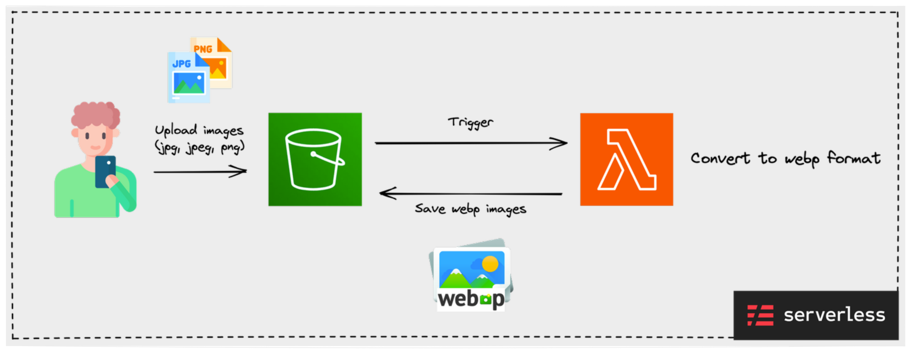

# Amazon S3 image WebP converter

[](http://www.serverless.com) 
[](https://www.python.org/downloads/release/python-380/) 
[](https://github.com/psf/black) 
[](https://opensource.org/licenses/Apache-2.0) 



AWS Lambda function for conversion the images of Amazon S3 to [WebP](https://developers.google.com/speed/webp) image format. 

When a user uploads an image file to Amazon S3, AWS Lambda is triggered and modified to WebP image format and saved.

<br/>

## Why WebP

WebP provides lossless and lossy compression as the modern image format. According to the [WebP document](https://developers.google.com/speed/webp), it has 26% smaller size than PNG and 25-34% smaller size than JPEG. 

In other words, WebP image format can be used to reduce the image size served by applications, which can reduce network traffic and increase transmission speed.

<br/>

## Requirements

Amazon S3 image WebP converter is written in the python language and is deployed to AWS Lambda using [serverless framework](https://www.serverless.com/).

- [Python](https://www.python.org/downloads/) (>=3.8) 
- npm
- [serverless framework CLI](https://www.npmjs.com/package/serverless)
- [serverless-dotenv-plugin](https://www.npmjs.com/package/serverless-dotenv-plugin)
- AWS account / IAM role (Amazon S3, AWS Lambda) / credentials 

<br/>

## Configuration

The environment variable is injected using the `dotenv-plugin` of the serverless framework to set the necessary information. 


| env name            | description                            | type    | default (current `.env`) |
| ------------------- |----------------------------------------| ------- |--------------------------|
| BUCKET_NAME | s3 bucket name                         | String  | my-bucket-name           |
| WEBP_DIRECTORY_NAME | directory in which to store webp files | String  | webp/                    |
| IS_DELETE_ORIGINAL  | whether to delete the original file    | Boolean | False                    |

You can set it in the `.env` file.

<br/>

## How to deploy 

Deployed to AWS Lambda via serverless framework. This requires AWS credentials with permissions to AWS Lambda, Amazon S3.  For more information, please refer to [serverless framework docs - AWS credentials](https://www.serverless.com/framework/docs/providers/aws/guide/credentials). 

If AWS credentials are set through `aws configure` command in the local environment, it can be distributed through the command below.

```
serverless deploy
```

<br/>

## References

- [serverless docs](https://www.serverless.com/framework/docs)
- [Lambda layer for using Pillow](https://github.com/keithrozario/Klayers)   

<br/>

## License

```xml
Designed and developed by 2022 KimDoubleB (Bobae Kim)

Licensed under the Apache License, Version 2.0 (the "License");
you may not use this file except in compliance with the License.
You may obtain a copy of the License at

   http://www.apache.org/licenses/LICENSE-2.0

Unless required by applicable law or agreed to in writing, software
distributed under the License is distributed on an "AS IS" BASIS,
WITHOUT WARRANTIES OR CONDITIONS OF ANY KIND, either express or implied.
See the License for the specific language governing permissions and
limitations under the License.
```